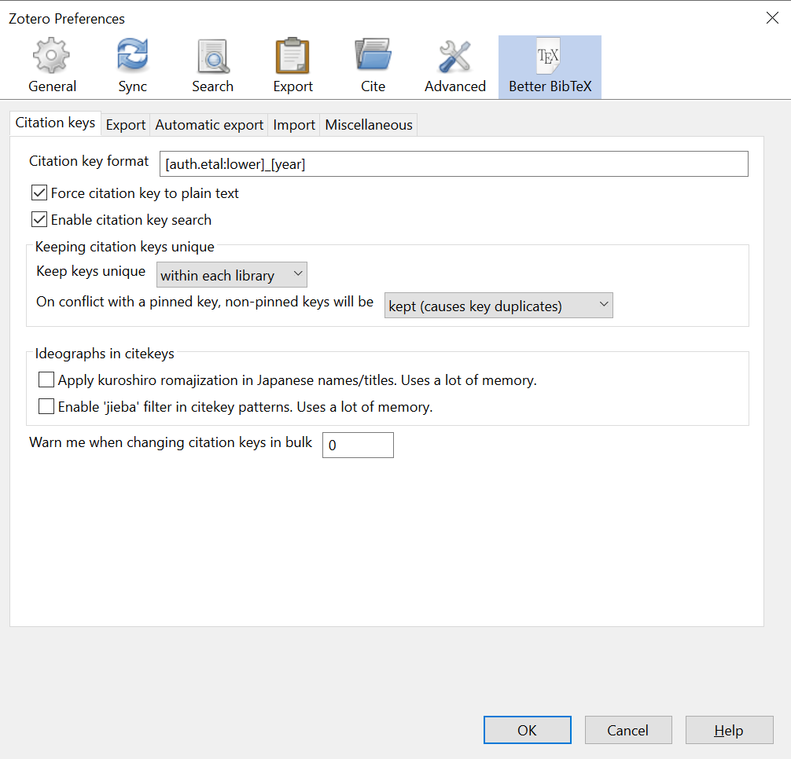

<style>
.caption {
  font-size: 0.9rem;
  font-style: italic;
}
.article-style img {
  margin-bottom:0;
}
</style>
On October 12 and 19 (2021) I participated in a few amazing sessions organized by some colleagues at the Linguistics Department, titled *I was never taught how to do this*.

```{r, echo=FALSE}
blogdown::shortcode('tweet', '1451512845057855490')
```

I got to talk about [Git and Github](../2021-04-10-learning-slopes/), [Zotero](https://www.zotero.org/) (with Giulia Mazzola) and [Evernote](https://evernote.com/). I've used Evernote for note-taking for the last 6 years and a half (so, most of my research career up to now) and Zotero for bibliography management for a bit longer. However, as we were preparing our presentation, Katharina Meissl introduced me to [Obsidian](https://obsidian.md/) and now ---I want to [move everything to Obsidian and just stay there](https://github.com/akosbalasko/yarle).

<!-- This new discovery came right on time for a new stage of my life: now [I am a doctor](../../event/2021-09-21-defense/), currently working as a post-doc. While my tasks are quite similar, it is an excellent point to take stock and change some practices. Moreover, after creating a blog, slides and my own thesis with R Markdown, I'm excited to soak markdown into everything else. -->

Here I will talk about how I'm integrating Zotero (and [Better BibTex](https://retorque.re/zotero-better-bibtex/)) with Obsidian and how that is reshaping my notes and organization. First I will [introduce Better BibTex](#bb) and then [how we combine it and Zotero with Obsidian via a community plugin](#howto).

# Zotero and Better BibTex {#bb}

Better BibTex helps you clean and manage your Zotero references. It may have more functions than I'm aware of, but the main feature I'm interested in is in defining the **citation key**. If you only use Zotero in combination with MS Word or Open Office, this might be irrelevant, but when you handle [bib(la)tex files](http://www.bibtex.org/), e.g. for $\LaTeX$ or R Markdown, it's super important.

A bibtex entry looks like these:

```{r, echo=FALSE, comment=""}
toBibtex(citation('blogdown'))
```

The word next to the `@` symbol points to the type of element (e.g. 'Manual', 'Book'), and the entry consists of key-value pairs with different kinds of bibliographical information. In this case, I obtained it via the `toBibtex()` and `citation()` functions in R, but you can often find this format as an option for downloading a citation, or as an export option in Zotero. If you have a file with BibTex entries, you can also import them to Zotero (or if you copy a BibTex entry, you can import it to Zotero from the clipboard!).

R Markdown and $\LaTeX$ can read BibTex files: you just enter the citation key and, when your text is compiled, your source is cited perfectly. For example, in R markdown I could write `[@montes_2021]` to cite my thesis, and it would be rendered as `(Montes 2021)` or however it should be based on the chosen citation style. Then, all the relevant information tied to the citation key `montes_2021` would be used in the full reference.

The entries above, however, have no citation key. As it stands, you have to add them manually, before the comma in the first line of each entry.^[In R markdown, you can use `knitr::write_bib()` to create the same output as before, with nice citation keys.] When, instead, you export your entries from Zotero without Better BibTex, the default keys tend to be long names in camelCase, such as `montesCloudspotting2021`. Better BibTex gives you a nicer default pattern and the possibility to create your own template for easier-to-remember citation keys.

Once you have [installed Better BibTex](https://retorque.re/zotero-better-bibtex/installation/), you will find a new tab in your Zotero Preferences, where you can define a [template](https://docs.jabref.org/setup/citationkeypatterns) for your citation keys. Mine uses, in lower case, the last name of the first author, separated by a period from the last name of the second author or, if there are more than two, *etal*. Then, it adds an underscore and the year.



This is a good pattern for me because it's similar to how I'm used to thinking of the sources I cite: `montes_2021` for Montes (2021); `kiela.clark_2014` for Kiela & Clark (2014); `heylen.etal_2015` for Heylen et al. (2015). When multiple publications have the same key, Better BibTex automatically adds an *a*, *b*, *c*... to the citation key. You have to remember which is which, but looking it up is not so hard either:


In short, using Better BibTex gives you a nicer experience with BibTex files, e.g. using R markdown or $\LaTeX$. Now... what about Obsidian?

# Citation plugin for Obsidian {#howto}

I can make Obsidian and Zotero talk to each other thanks to [a plugin](https://github.com/hans/obsidian-citation-plugin). Obsidian requires you to first enable community plugins, but then it's really easy to install it.


Once you turn off 'Safe mode', you have to 'browse community plugins', search for the citation plugin, install it *and enable it* to use it. That's it.

One of its most interesting features is the **literature note**: a note with bibliographical information extracted from your Zotero entry... well, technically, from a BibTex file exported from Zotero (or any other bibliography manager). I will address this later, but for now let's assume you have a BibTex file with all your Zotero data. With `Ctrl`+`Shift`+`E`, you get a dropdown menu in which you can search through all your entries. Once you select one, it creates a note that, by default, uses your **citation key** as the title, and adds a bunch of information to the preamble of your note. It can also add other information, such as the abstract or, more interestingly... *a link to your Zotero entry*. When you click on that link, it opens Zotero; if it is already open, it selects the reference you clicked on.

This is a lot of information, I know. That is why I will first show how I'm using this plugin now and then I will talk a bit more about how to customize the literature note and create other links to Zotero entries by hand.

## How I use it

Back when I was using Evernote, I had one notebook per source I read and its first note was a sort of bibliographical card, with basic information so I remembered what it was a long time later (it also forced me to check the outline of a paper, for example, and get more familiar with it before reading it). Sometimes, when a source A cited another source B I had already taken notes from, I would link the citation in notebook A to the bibliographical card of B.
Setting this up required me to copy the information from Zotero, and I found it sad that it wasn't really *connected* to Zotero itself.

With Obsidian, inside my research vault, I have a folder for "Reading notes", where I plan to add folders for different sources (and import them from Evernote, too). It turns out that one of the citation plugin's main features, the literature note, is precisely an *automatic version* of my beloved bibliographical card!

As an example, let's say I want to add a folder for notes on Koptjevskaja-Tamm and Sahlgren's (2014) paper. First, I press `Ctrl`+`Shift`+`E` and select the right entry.


This creates the following literature note in my "Reading notes" folder:


The main bibliographical information is in the Yaml (but need not be), and then there is a hyperlink that shows the citation key (which, preceded by a `@`, is also the name of the note) and takes you to the Zotero entry: if I click on it, it goes to Zotero and highlights that reference.

I will later add the abstract, the outline of the paper and some comments on why I'm reading it. I also manually create the "Koptjevskaja-Tamm & Sahlgren (2014)" folder to add my new literature note and, later, other notes I might want to make.

{}
Next to creating the literature note, if you are also using the "Daily notes" plugin of Obsidian, it will automatically add an internal link to your new literature note in your current Daily note! Awesome integration with your new favorite journal!
{}

Because the name of the note follows your chosen citation key pattern, you can easily use it to reference the source as well as the bibliographical data. So my current (new) practice is to add *all* references (that is, when I take notes from a source that is citing another source I might be interested in) in the format of internal notes.

For example, suppose I'm taking notes for Koptjevskaja-Tamm & Sahlgren (2014) and it references Lenci (2018). I could write it as `[[@lenci_2018]]`, i.e. an internal link to the literature note that I could create for that second source. Even if I have not created the note yet, Obsidian lets me create the link, which means that (i) whenever I create the note it will be already linked and (ii) *notes that cite the same source will be linked in the note network*. The image below shows a bit of my network of notes: there is no literature note for `@curran_2004` yet, but it is referenced in two notes and thus connects them.


The easy citation key pattern means that I can guess what the reference should look like, but if there is a chance that it actually ends in *a*, *b*, etc., I can also use the plugin's citation tool. I haven't created a hotkey for it yet, so I have to go to Obsidian's command palette and choose `Citations: Insert Markdown citation`, which takes me to a menu of all my references again.


The plugin allows you two kinds of citation ---you access the primary one by pressing `Enter` and the secondary one with `Shift`+`Enter`. By default, this will insert something like `[@lenci_2018]`, i.e. the [pandoc format](https://pandoc.org/MANUAL.html#extension-citations) used by R markdown. But, as I will show later, you can customize it to return `[[@lenci_2018]]`, and therefore it becomes a link that you know for sure will take you to a(n eventual) literature note for that source. You can even customize it to return `[@lenci_2018](zotero://select/items/@lenci_2018)`, that is, the Zotero entry in your Desktop app!^[The pattern to create the link to the Zotero entry is `zotero://select/items/@` + the citekey (e.g. `lenci_2018`)]

As a plus, you can then copy the texts with references to your R markdown files to create nice articles with perfect citations, just by replacing `[[` with `[` and `]]` with `]`.

## Customize the plugin

For a better, smoother, more tailored experience with the citation plugin, you can customize it in a few ways. I will show here what it looks like for me.

In the Settings of Obsidian and the section for the Citation plugin, you first have a few configuration items to take care of.


- I use BibLaTex (as opposed to JSON) format for my entries, which I described above (as BibTex).
- I have exported my full Zotero library as a `Library.bib` file, which is stored at the top level of my vault. If you make changes to your library, you have to export it again, but then Obsidian automatically refreshes.
- When I create a literature note, it's automatically saved within "Reading notes" (and then I move it to the folder of that source).

Under the basic configuration settings there are some instructions on how to deal with the following customization sections. You will write templates with variables between double curly braces, which means that they will be replaced with the matching information for the reference you cite. In other words, once you select the reference with citation key `montes_2021`, all the variables here that say `{{citekey}}` will be replaced by `montes_2021`.


Given those instructions, the title of my literature notes starts with a `@` followed by the citation key (variable: `{{citekey}}`, example value: `montes_2021`). The initial information will be determined by the values in that template: a yaml will be created adding the values of `{{title}}` (the title of the referenced work), `{{authorString}}` (the names of the authors), `{{year}}` (the publication date) and `{{page}}` (the number of pages or the pages range), and then the body will include the hyperlink to the Zotero entry and, if available, the abstract.


```md
---
title: {{title}}
authors: {{authorString}}
year: {{year}}
page(s): {{page}}
---
[{{citekey}}]({{zoteroSelectURI}})

{{abstract}}
```


{}
In case you are not aware, you can create hyperlinks in markdown with square brackets followed by round brackets. For example, `[my thesis]` `(https://cloudspotting.marianamontes.me)` will show the text in brackets and take you to the text in parenthesis: [my thesis](https://cloudspotting.marianamontes.me). Obsidian's `[[text]]` is a shortcut for `[text]` `(text)`. Therefore, if I take a citation key `{{citekey}}` and place it between the square brackets, and then the `{{zoteroSelectURI}}` variable between the round brackets, I will get a hyperlink that looks like the citation key but takes me to the Zotero entry, as I showed in the example of my literature note above. 
{}

The same knowledge can be used with the last section of the customization, which relates to the citation templates.


As I mentioned before, you can have a primary and a secondary citation: when you ask for the citation in the command palette and it shows you the possible entries, `Enter` prints the primary citation and `Shift`+`Enter` prints the secondary one. In the images above, I designed the primary citation to print the hyperlink to the Zotero entry, and the secondary one to print the reference to the literature note `[[@{{citekey}}]]`, e.g. `[[@montes_2021]]`.

Finally, I would like to point out that I've been working with both Markdown and Better BibTex for a while, so if you haven't, this can look like a lot to take. I hope you can find the time to experiment with this (or at least copy what I did, it might work for you!) and it helps your note taking, bibliography management and general levels of fun and stress!