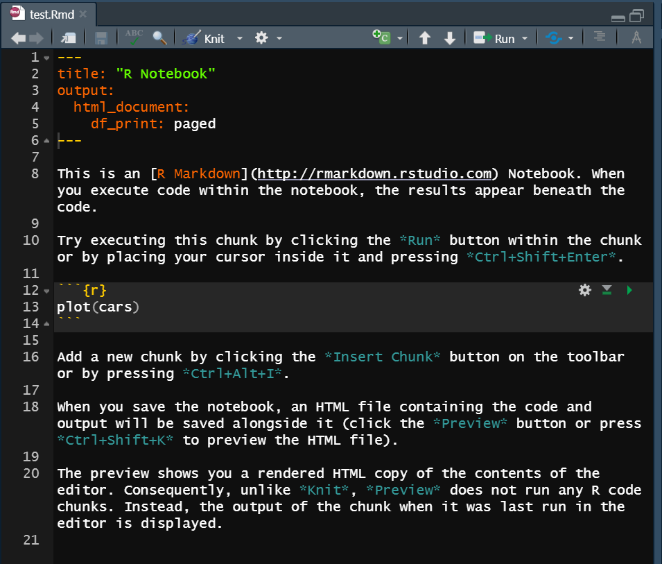
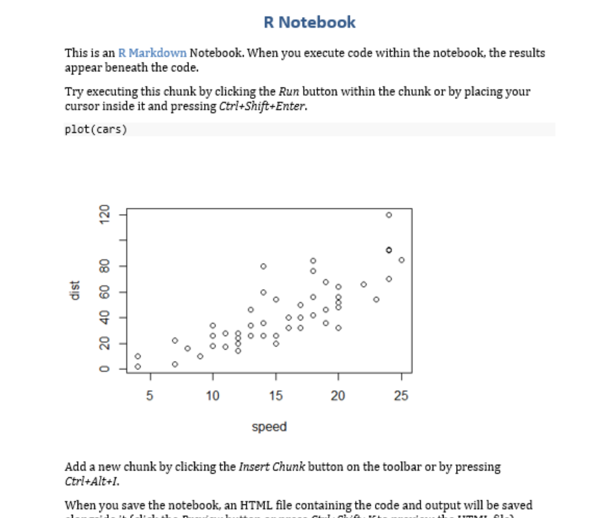
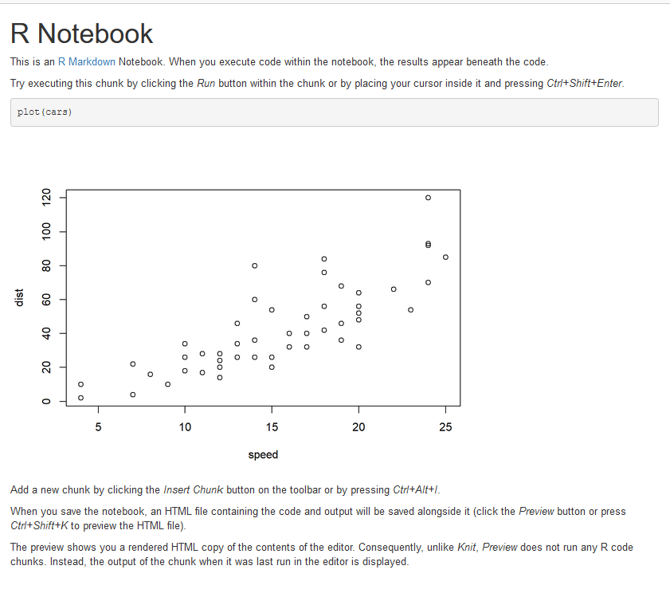
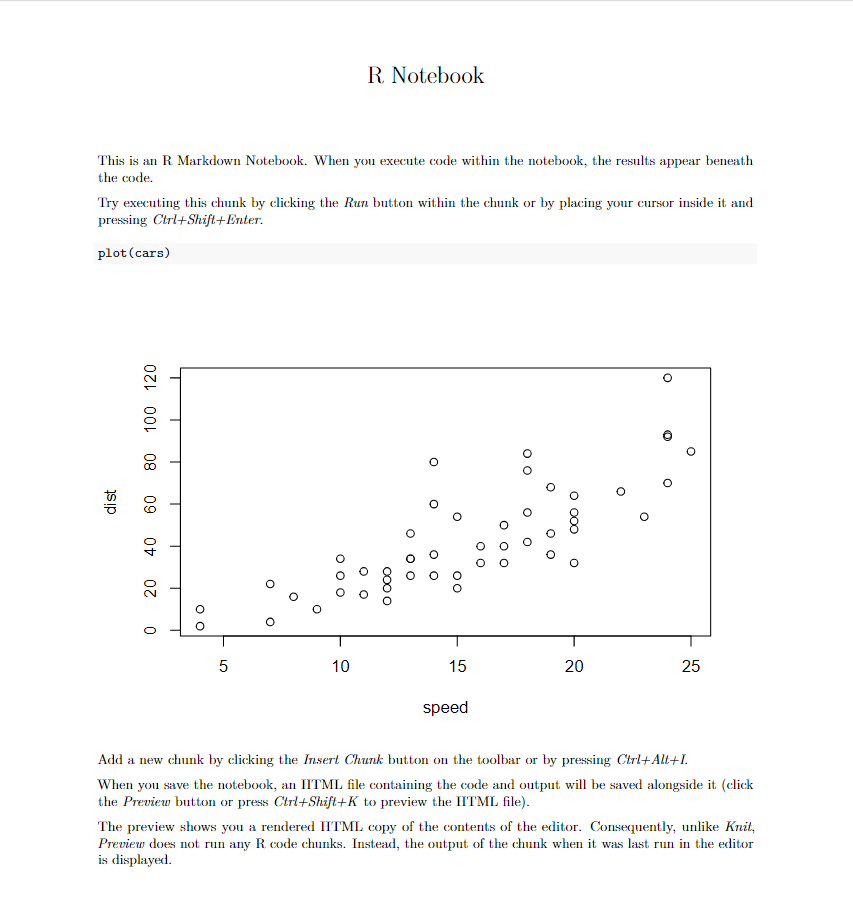
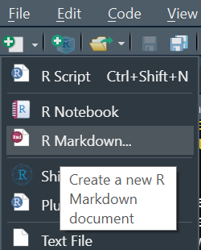
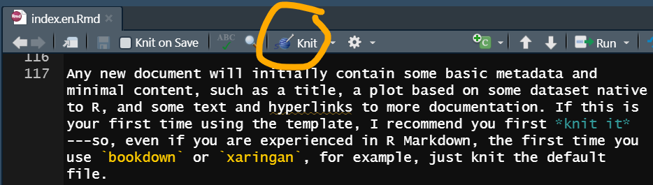

```{r, include=FALSE}
knitr::write_bib(
  c("rmarkdown", "rmdformats", "xaringan", "blogdown", "bookdown", "vitae", "officedown"),
  file = "bib.bib"
)
```

As a researcher with (maybe quantitative) data, what do you use to write, and did you ever think of alternatives? A very common answer to the first question is MS Word, because it's a popular program that comes with the very popular OS Windows, everyone knows how to use it (it is indeed quite user-friendly) and publishers will often ask you for Word files^[It could also be OpenOffice, or whatever the Mac counterpart is...]. In certain fields $\LaTeX$ is also very popular. Here I want to talk about R Markdown, which is quite close to $\LaTeX$ in many respects and entirely different from Word, although you can still make your Word-demanding publishers happy with the help of packages like `officedown` [@R-officedown]. In this post I hope to convince you to use R Markdown ---at least plant a seed that will eventually grow into a burning desire to use it. Once the interest is sparked, in the [following post](../2021-10-31-academic-writing-in-r-markdown-ii/) I will share my experience writing my PhD thesis with R Markdown.

<figure style="float:right;width:40%;">

<figcaption>[Artwork by \@allison_horst](https://github.com/allisonhorst/stats-illustrations/)</figcaption>
</figure>

If you have never used R Markdown, and especially if you have no familiarity with R at all, I hope you to still give it a try, even if it seems very intimidating at the beginning. But. There are some caveats. Like with any other new skill, whether you can take on this challenge depends on how much time and energy you have, on the support you already receive to learn new skills, on the community around you and what tools *they* use. It also depends on how you approach technology and research.

My father once drew this mind-blowing comparison to me that I keep applying to a lot of tech-related things and to people's attitude towards software^[It is also related to Yihui Xie's distinction between ["data analysts and software engineers"](https://yihui.org/en/2018/09/notebook-war/) and Hadley Wickham's between ["practitioners and programmers"](https://www.youtube.com/watch?v=Qne86lxjgtg), which helped me give more shape to this idea.].
On the one hand you have programs that bundle a lot of functions into a very neat, user-friendly interface, and select the workflows and functions that you're more likely to use ---but then limit you to the options they give you, and there is not much more you can do. (I also tend to link this to proprietary software with their own particular file formats that almost no other software can read.) I would put MS Word on that side.
On the other side you have tons of tiny programs, each of them fulfilling one unique function, offering you the full freedom to combine them as you wish, but no guiding path, no set workflows that can help the initiate. That is how the command line programs in Linux work, for example. It also *implies* interoperability: the programs must communicate with each other, and therefore work with the same file formats. I put R Markdown and the family of packages that expands its functionality on that side^[Granted, using R Studio pushes it a tiny bit to the other side.]. 

I see them as poles in a continuum, and we may move between one or the other as we get more familiar with different tools. In my case, I like to go to the second side, because I like learning to use all the little tools and combining them in all my freedom, rather than bumping against the walls of a beautiful, user-friendly marble salon. Using either R (or Python) to do analyses or using, instead, SPSS, Excel or even [JASP](https://jasp-stats.org/)^[Which is based on R.], is standing more towards one side of the continuum or the other. It is not always a conscious choice ---it depends on what you learn and how-- but I believe that at some point it should be. If you lean towards the first side, to pre-packaged, user-friendly, everything-in-buttons kind of software, then this post is probably not for you. If you are still exploring or already leaning on the building-blocks, more-typing, interoperability-loving side, keep reading.

I will start by explaining [why I prefer R markdown](#why) over MS Word or $\LaTeX$, and then follow with some [tips](#tips) on how to start and get used to it. This is not a manual and it does not replace the reference work out there; it just complements it with my experience.
<!-- I wouldn't recommend starting with your thesis, because a thesis is hard enough without having to learn a new format for writing, but R markdown does come with awesome documentation and very handy templates to slowly get the hang of it. -->
Then I will [introduce `bookdown`](#bookdown), an R package that expands on `rmarkdown` with extra functionalities to create an actual *book*... but that can also help with shorter texts where you want nice cross-references.

# Why R Markdown? {#why}


R Markdown [@R-rmarkdown] is an R package (a bundle of functions and such) that takes text written in markdown and parses it via [pandoc](https://pandoc.org/MANUAL.html) into other formats such as HTML, PDF or even Word and its family. You need to install R and (preferably) R Studio as well as the package itself, but if you are already doing empirical research it is likely that you already have (or not a bad addition to your toolkit in any case). All this is open-source, free software with tons of amazing documentation online.

The main reason why I like R Markdown is that it's perfect for data-based writing (although I still use it for other forms of writing, like this post). When writing a research report, a paper or my thesis, my source text is connected to my dataset and calls it for anything related to it, from mentioning how many items it contains, to creating plots and tables based on the data. I'm not sure about $\LaTeX$, but with MS Word you would have to run your analyses and generate your images and tables somewhere else, and then insert them into your file. Maybe you are manually transcribing your data, or putting it through some transformation that is not recorded anywhere.

<figure style="float:right;width:40%;">

<figcaption>[Artwork by \@allison_horst](https://github.com/allisonhorst/stats-illustrations/)</figcaption>
</figure>
With R Markdown, instead, you can merge your analysis process, thinking process, description and exposition in one place. No danger of mistyping when transcribing the contents of your table. No chances of forgetting what that plot was representing. If your data changes, the rendering changes accordingly (you can even generate [automatic reports](https://bookdown.org/yihui/rmarkdown-cookbook/parameterized-reports.html)!). Maximum transparency and reproducibility.

Even without this main selling point, there are other advantages.
The other two writing tools I know best are MS Word and $\LaTeX$, why do I still go for R Markdown?

## Why not MS Word?

Unlike MS Word, R Markdown (like $\LaTeX$) lets you focus on content, and format comes later. From a certain perspective, *while you're writing* Word input looks better (prettier?) than markdown input (until you get used to it), but then the *output* looks so much neater with R Markdown than with Word (even when the output is Word).

<figure>


<figcaption>R Markdown source file and its MS Word output.</figcaption>
</figure>

I think one reason for this is that with MS Word you can use styles, while in R Markdown you cannot *not* use styles. Everything has a function and format is linked to that function. You rarely need to tell R Markdown: "make this neat and pretty". If anything, you can have fun making it extra gorgeous in ways I don't think MS Word could handle.

<figure>


<figcaption>Most basic HTML and PDF rendering of the default R Markdown template.</figcaption>
</figure>

Next to this core component, other advantages of R Markdown (and $\LaTeX$) over MS Word are:

- **Formatting of images and tables**:  They are much more neatly formatted and located, there is no need to move them around to fit the page, or not nearly as much as with Word.
- **Commenting text**: You have a paragraph or section that you don't want to get rid of just yet but want out of the way? In MS Word you would need to cut and paste to another file with all the other misfits: in R Markdown you just *comment* the text. If you've never done programming this just consists of surrounding the text in special symbols^[R Studio has you covered with `Ctrl`+`Shift`+`C`.] so that it is invisible to the program. You will still have the text in your source file but will not be rendered in the output.
- **Cross-references**: Creating cross-references to another section of your text, to figures or to tables is extremely easy and straightforward. They are also automatically refreshed ---in MS Word the last time I did this I had to select the full text and "update fields". Citations also become cross-references to the reference at the end of your text.

## Why not $\LaTeX$?

R Markdown is not so different from $\LaTeX$ ---in fact, it *uses* $\LaTeX$ to generate the PDF output, so the end product looks the same. You can even include $\LaTeX$ code to write formulas (e.g. `$a = \frac{1}{n}$` is rendered as $a = \frac{1}{n}$), insert Greek letters (e.g. `$\alpha$` is rendered as $\alpha$), etc. The main difference is in the input: the markdown markup is much easier to read and write. When I first started with $\LaTeX$ I thought it looked awful in its source format but so beautiful in the output that it was worth it. Yet, R Markdown does the same with a less ugly input (unless you choose to include $\LaTeX$, of course). Moreover, R Markdown offers a range of other output formats, such as HTML, which can be so incredibly beautiful and interactive.

# Tips to start {#tips}

If you were convinced by my arguments in favor of R Markdown but you have no experience writing with markdown or with $\LaTeX$... how do you start? The world of R Markdown is so vast and plentiful, how do you not *drown*?

The first step is, of course, to [install R markdown](https://bookdown.org/yihui/rmarkdown/installation.html). Assuming you already have R and R Studio, you run on the console:

```r
install.pacakges("rmarkdown")
# if you want Latex output:
install.packages("tinytex")
tinytex::install_tinytex()
```

<figure style="float:right;width:30%;">

<figcaption>Create new R Markdown file in R Studio.</figcaption>
</figure>

The second step is to create an empty document.
Both `rmarkdown`, packages that offer templates (e.g. `rmdformats` [@R-rmdformats]) and packages that expand on formats (e.g. `bookdown` [@R-bookdown] for books, `xaringan` [@R-xaringan] for slides, `blogdown` [@R-blogdown] for blogs, `vitae` [@R-vitae] for CVs) come with handy starting documents that often work as documentation.

Any new document will initially contain some basic metadata and minimal content, such as a title, a plot based on some dataset native to R, and some text and hyperlinks to more documentation. If this is your first time using the template, I recommend you first *knit it* ---so, even if you are experienced in R Markdown, the first time you use `bookdown` or `xaringan`, for example, just knit the default file.


<figure>

<figcaption>Knit it.</figcaption>
</figure>

That way, you can have an idea of the mapping between what you see in your .Rmd file and the output. You can try out the different kinds of output, and that way also make sure that everything is running properly.

Once that very basic setup works, you can start playing with the content: modify the title in the metadata, change the title(s) in the source file, remove the image, write whatever you want... As you make changes, you can keep knitting the file to see what happens. If things don't break, you can extend your reach, add more text, include your data, etc. @rmarkdown2018 and @rmarkdown2020 are excellent ---free, available online--- resources to get more and more proficient. I do recommend that you start adding skills as you *need* them. The moment you want to add a plot, go check how to. When you feel the need to cite, go look at the documentation and try. Do not try to get everything in at once, because it's A LOT. Do appreciate the awesomeness of every little step you are taking.

# Introducing `bookdown` {#bookdown}


R markdown is the basic foundation of this workflow, but there is a full constellation of connected packages that expand on different features. One of them is the `bookdown` package [@R-bookdown], mostly meant for the writing of books. Many books *about* R are written like this.
<!-- The ones I have read up to now (and that made me want to write my own) include: -->

<!-- - Hadley Wickham & Garrett Grolemund's [*R for Data Science*](https://r4ds.had.co.nz/) -->
<!-- - Hadley Wickham's [*Advanced R*](https://adv-r.hadley.nz/) -->
<!-- - Yihui Xie's [`bookdown` documentation](https://bookdown.org/yihui/bookdown/) as well as R Markdown's documentation [@rmarkdown2018, @rmarkdown2020] -->
<!-- - Jenny Bryan *et al*'s [*Happy Git with R*](https://happygitwithr.com/) -->
<!-- - Claus O. Wilke's [*Fundamentals of Data Visualization*](https://clauswilke.com/dataviz/) -->

The three important points of `bookdown` for me are (1) chapter organization, (2) git integration and (3) easier cross-references.
The first two are linked to the fact that your full book is one R project, which can be linked to one Git repository. With my smaller R reports, I might have one large R project (which is often also [a git repository](https://happygitwithr.com/)) with multiple, unrelated analyses that may work with the same dataset or something. With `bookdown`, instead, you have one .Rmd file for each of your chapters, and everything is knitted together into one unitary entity: one website with different HTML files for each chapter joined by a table of contents, or one unique PDF/EPUB file. You can't really insert an independent .Rmd file inside your project and knit it independently.

Because of this, if you want to send your text to someone (for proofreading, for example), you will either send the full PDF or a bundle of HTMLs^[If that someone can proofread in R Markdown that would be even better though.], which might not be so convenient. In terms of writing, however, I find this organization very useful: you can focus on your chapter and its own file or easily reorder the different chapters, but they are always connected. The appropriate table of contents is generated automatically and you can even cross-reference *to sections in a different chapter*.

The fact that the book is contained in [its own project](https://www.tidyverse.org/blog/2017/12/workflow-vs-script/) makes it very neat in terms of how you manage and understand the relationship between the components: not just the different chapters but the bibliography, the datasets, the figures, etc. It forces you to organize the contents in a more compact and coherent way. It is also a perfect match with git (version control!) and for eventually sharing your project with the world as a GitHub repository or even a GitHub Page (which is how my thesis is shown to the public too).

Finally, while cross-references with R Markdown are quite basic, referencing a figure or table is much easier in `bookdown` (see [my next post](../2021-10-31-academic-writing-in-r-markdown-ii/#render)). Note that `bookdown` also offers single-file formats, such as `html_document2` or `pdf_document2`, which expand on the basic `rmarkdown` counterparts with this new feature.

# Final thoughts

If you want to learn about R Markdown, you can just google it and you will be bombarded with cheatsheets, reference books and posts. There is a lot out there. What *I* can offer is my own experience: why *I* think it's amazing, what I think you should be careful about, where I have tripped and what brings me joy. Knowing that it's there doesn't really tell you why you should care, what is in it for you, how it can make *you* happy. I hope this helps.

# References

