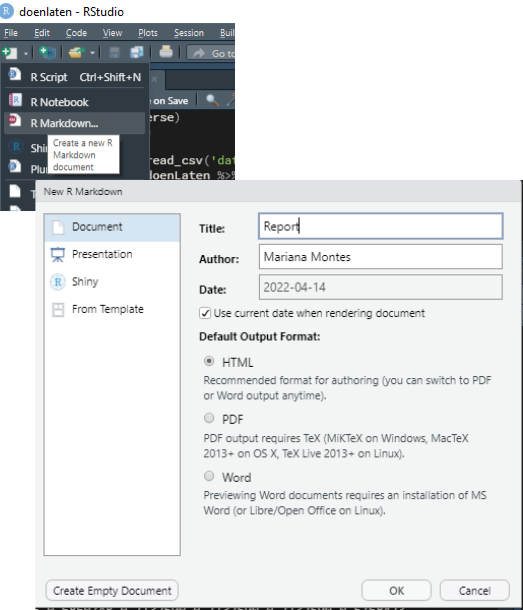
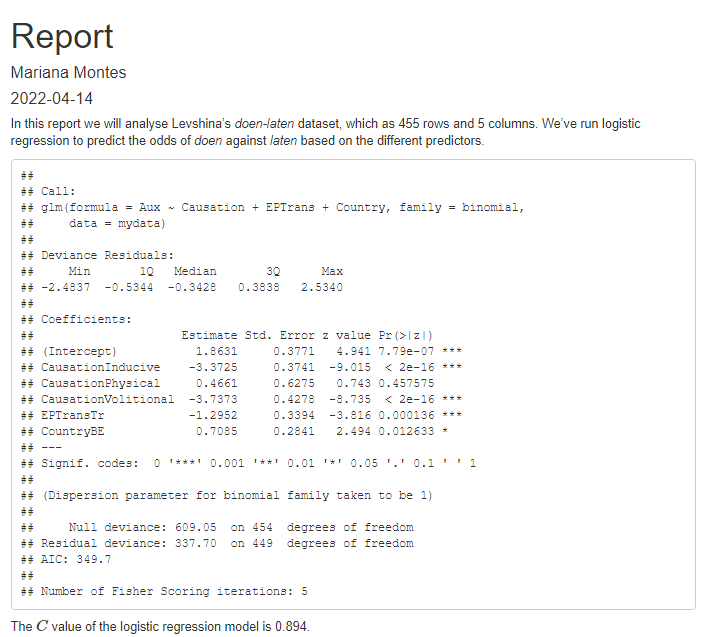
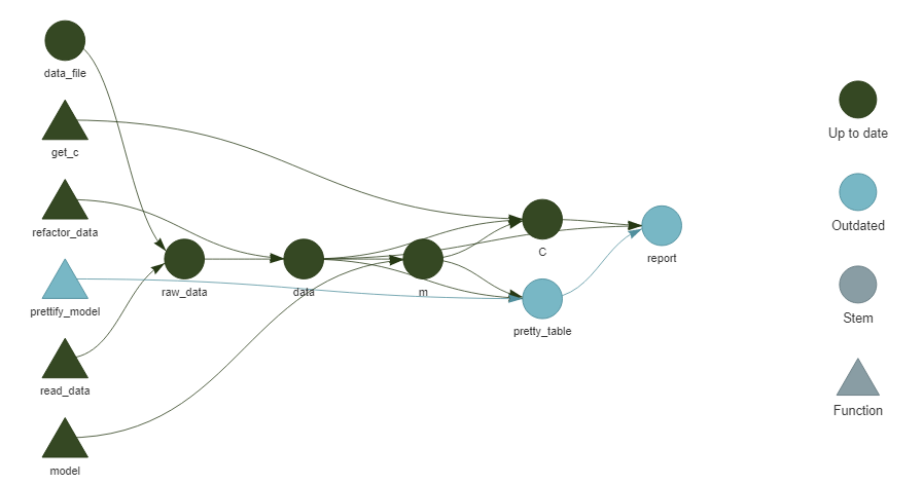

```{r, include = FALSE}
library(tidyverse)
library(Hmisc)
data(doenLaten, package = 'Rling')
```


When you first learn R, you rarely start by acquiring Best Practices: tips to keep your code organized, reproducible and at least not hopelessly messy. You wouldn't, because you want to get results... and because Best Practices are solutions for problems that you haven't encountered yet. It is hard enough to learn how to filter a dataframe in R when you have never encountered a dataframe that matters to you, let alone wanted to filter it. Learning the most appropriate folder structure to store the dataframe and your analysis does not really stand out as an interesting goal until you have so many dataframes you care about, so many questions to answer with code, that it overflows all logic and you can't just keep track of it in a post-it any more. But by then you are not taking courses on R any more, and unless you happen to run into a colleague and the topic comes up of how much time you spent this morning trying to find the function that created the best plot you ever made, or unless you follow the right people on Twitter and they [mention cool stuff](https://twitter.com/mdneuzerling/status/1513665573351145472?s=20&t=5CTH6fXVTJ7ltMyqdc7Fmw) out of the blue... how will you learn those things? Even if you find out about amazing solutions to these problems, their implementation is not obvious enough. You have a cup of tea with a lump of sugar at the bottom, you find a spoon, but it doesn't immediately occur to you that the spoon is the answer to your problem, because the documentation of the spoon incorrectly assumes you already know what *stirring* is. Or you find a video of somebody stirring their tea with the spoon, but you can't figure out how they got the spoon inside the cup in the first place. What is worse: those who know how to use spoons have forgotten what it means to be unaware of them.

I would like to address those feelings with this post. I recently found out about two R-project tools that blew my mind, and I want to start implementing them in my workflow. I also thought it could be practical to show how you can start up a project like this from scratch, maybe learning some Best Practices along the way. You don't need to know all the tips at the beginning: you learn them best by messing up, and as long as things work, it's fine.
If I write this properly, after this post you will be able to create an R project and GitHub repository using the packages `here`, `targets` and `renv`, write a brief R Markdown report with some analysis of a (clean) dataset, and leave with the confidence that:

- you know what your project contains;
- the report matches your data and analysis;
- anyone with access to your project can reproduce it;
- you can rerun everything you need with one line of code.

The output of this workflow can be found in [its GitHub repository](https://github.com/montesmariana/doenLaten), but the idea is to give you the instructions to start it _from scratch_. It is a looong post with a lot of detail, so sit back and relax, take your time and enjoy the ride.
Let's go!

# Initialize a project

Some time ago I learned about RStudio projects. I don't remember when, and I don't remember the foggy, chaotic times before. Now and then I imagine what my life would be like if I worked on R without projects and chills go up my spine.

RStudio projects support a [project-oriented workflow](https://www.tidyverse.org/blog/2017/12/workflow-vs-script/), where you have one folder for each different project you work on and the paths called within the project are always relative to the root of the project. Suppose, for example, that your project folder looks like this:

```shell
|-- data/
    |-- dataset.csv
|-- scripts/
    |-- code.R
|-- report.Rmd
|-- report.html
```

If you run code from `scripts/code.R`, you might want to find your dataset as `../data/dataset.csv`, whereas from `report.Rmd` you would need to read `data/dataset.csv`. But if you call `scripts/code.R` _from_ `report.Rmd`, the path within `scripts/code.R` has to become `data/dataset.csv`! And if one day you decide to move `scripts/code.R` to a different folder, you will need to update the path to the dataset, even if the dataset itself didn't move!
You might be tempted to use absolute paths, like `C:/Users/username/projects/thisparticularproject/data/dataset.csv`, but then when you change computers it doesn't work any more. A reproducible project should be able to change computers, at least.

<figure style="float:right;width:40%;">

<figcaption>[Artwork by \@allison_horst](https://github.com/allisonhorst/stats-illustrations/)</figcaption>
</figure>

With the [`here` package](https://here.r-lib.org/), the `here::here()` function returns the absolute path of the project (in this case `C:/Users/username/projects/thisparticularproject`); if you move the project somewhere else, to another directory or computer, it will return whatever the absolute path turns out to be. Then, `here::here('data')` will return the path to the `data` folder wherever you call it from within the project. Therefore, either from `code.R`, `report.Rmd` or wherever else in the project, `here::here('data', 'dataset.csv')` will _always_ point to `data/dataset.csv`. Neat, right?

Organizing your work in projects also means that different studies, analyses, explorations are kept separate, and can even be run simultaneously without intervening with each other. For example, I can write this blog post on my blogdown project and create and work on a new, different project at the same time, each with their own RStudio window, their own log and data on memory, etc. While writing this I can go to the top right corner of my RStudio window, click on the triangle next to the name of my current project, select "New Project", choose to create a normal project^[It could also be a blogdown project, like this blog; a bookdown project, an R package...] and set up the main points: the name of the folder and its location (Figure \@ref(fig:startProject)). For about an year now I started making my projects as git repositories as well and storing them like all other git repositories, in a folder called `repos` which has a subfolder per username and then their repositories inside. For example, `repos/montesmariana` has all my git repositories, be they R Projects or not (e.g. python code); `repos/another-user/repo-I-cloned` stores some git repository by `another-user` that I cloned for their code or data, to collaborate with them, etc.^[I must give credit to Miguel Montes for the idea; I didn't really see the point the first time he told me about it but I followed his advice and it has really paid off.] The project creation wizard has the options to set up the project immediately as a git repository and to use `renv`; both can be applied post-hoc[^posthoc], but let's go ahead and select them. I'm showing how to do this from scratch, after all.

[^posthoc]: If you want to learn how to set up git, especially if you have never used git and don't have a GitHub account (I won't cover that here), I recommend checking out Jenny Bryan et al.'s [*Happy Git with R*](https://happygitwithr.com/index.html). [`renv`](https://rstudio.github.io/renv/articles/renv.html) can be initialized in an open project with `renv::init()`.

(ref:startProject) Screenshots of the first steps creating an R Studio project.

```{r, startProject, echo = FALSE, fig.cap = '(ref:startProject)', fig.alt="Three screenshots of the steps to create an RStudio project, slightly overlapping. The first shows a dropdown menu with the option to create an RStudio project. The second shows a window with options of the kinds of project to initialize, and the basic project indicated with a green rectangle. The third one shows a dialog window that lets you name your project and select an initialization configuration.", out.width = '80%'}
knitr::include_graphics("images/createProj.png")
```

I've already talked about using git [elsewhere](https://howtobecomearesearcher.wordpress.com/2022/02/14/git-your-version-straight-what-can-you-do-with-git-and-github/), but what about `renv`? I actually learned about it recently and have not used it yet, but it appears to solve an issue I have had to work around before: package versioning for my projects. R 4.1 came out while I was writing my [dissertation](https://cloudspotting.marianamontes.me/), and I didn't dare install it until it was finished, lest it make anything crash in my fragile bookdown project. If I had known what `renv` was, I could have kept my project isolated while using R 4.1 and the updated packages in other projects. In other contexts, `renv` will help me share projects with the precise information of the R and R package versions used to run everything and avoid conflicts that could arise between different versions of a function. To learn more about `renv` you may go to the [documentation](https://rstudio.github.io/renv/articles/renv.html).

We have now initialized a project. The file structure can be found in the Files panel - it only has configuration files that characterize an R project (`.Rprofile`, `.Rproj.user/` and `projectname.Rproj`) with `renv` (`renv/` and `renv.lock`) and a git repository (`.git/` and `.gitignore`). Note that `.gitignore` files tell git what not to keep track of; an R Project with git will already write a list of file extensions that should be ignored, but `renv` also creates a `renv/.gitignore` with a list of directories within `renv` that git should ignore.


# The dataset

Since this project is about data analysis, we first need to acquire some data. I wanted to give a linguistics example, ideally not in English (there is enough of that already), so I chose the `doenLaten` dataset of Natalia Levshina's [Rling package](https://github.com/levshina/Rling), companion of her wonderful *How to do linguistics with R* [@levshina_2015]. To install the package you can follow the instructions on the README file, and then the dataset is available with `data()`:

```{r, eval = FALSE}
install.packages('path/to/file/Rling_1.0.tar.gz',
                 type = 'source', repos = NULL)
data(doenLaten, package = 'Rling')
```

Since we are still learning, we'll open an empty R script, write the code in it and run it. Later, the `install.packages()` call should be removed or at least kept separate from analysis scripts.
As shown below, `head(doenLaten)` shows us the first rows of the dataframe.

```{r}
head(doenLaten)
```


Levshina introduces this dataset in chapter 12 of her book, to illustrate logistic regression; you can look at the documentation with `help(doenLaten)`. Each of the 455 rows of this dataframe represents an observation of the Dutch Causative Construction (in English it would be "I *made* you do this") with 5 variables:

- `Aux`, specifying whether the constructions uses the verb *doen* or *laten* where English would use *make*;
- `Country`, with level `NL` for data from the Netherlands and `BE` for Belgian data;
- `Causation`, with four different kinds of causation depending on whether the Causee and/or the Causer are mental entities or not (I won't get into that);
- `EPTrans` and `EPTrans1`, which specify whether the Effected Predicate (e.g. *do* in *I made you do this*) is transitive (i.e. it carries a direct object) or not.

The idea is to predict whether the observation contains *doen* on *laten* based on the other predictors; see @levshina_2015 [255-256] and her own PhD dissertation [@levshina_2011] for an explanation.

To get an idea of the data, we could run a few exploratory functions. For now, we can still type them in our temporary R script where we loaded the data: `head(doenLaten)`, `str(doenLaten)`, `summary(doenLaten$Aux)` to get an idea of the frequencies of the response variable. A fancy way is with `skmir::skim()` (but note that if you do this in your new project you will need to install `skimr`):

```{r}
skimr::skim(doenLaten)
```

In order to make this more comparable to a typical analysis, where you would have your own copy of the data, we'll have to save the dataset as a file in our project folder. This invites us to start loading the `tidyverse` package (or at least `readr`) but... it does not exist! If you try `library(tidyverse)` like you have many times before in your computer you might be confused by its sudden absence. But remember that we set up `renv` in this project, which means that it only uses the project-specific library: you have to install all the packages that you want to use again (technically, make a local copy if you have them installed already). Our next steps are then the following:

- Install tidyverse (which we'll use later as well) with `install.packages('tidyverse')`;
- Save the dataset as a csv file with `readr::write_csv(doenLaten, 'data.csv')`

Our current temporary R script will look like this:

```{r, eval = FALSE}
# Untitled.R

install.packages('../../levshina/Rling_1.0.tar.gz',
                 # type = 'source', repos = NULL)
data(doenLaten, package = 'Rling')
head(doenLaten)

install.packages('tidyverse')
readr::write_csv(doenLaten, 'data.csv')
```

After installing everything, we should restart R. To inspire you to even better practices, I will pretend I always save my temporary R scripts and save the file as `temp.R` (hopefully we don't have to run it again).

# The analysis

In Chapter 12 of *How to do linguistics with R*, Levshina uses this dataset to illustrate logistic regression. She shows how to use `rms::lrm()` and `stats::glm()` with a focus on the former because of its detailed output. Here I will only use `glm()` because, while it's harder to obtain the $C$ value and similar statistics, I know how to get the data for a prettier table that we'll report at the end of the post. I will also add some rough explanation of how to interpret the output, strongly informed by @levshina_2015, but I won't delve into the linguistic consequences ---this is just so that if you, reader, are not familiar with logistic regression, your head doesn't blow up in so many pieces.

First we will create a new R script to explore the output of the analysis. Writing code in an R script rather than on the console is a good practice, because you WILL want to run things again at some point, and it's easier to find that code in a file than in the console. (I often start testing ideas in the console and it's the equivalent of whisking egg whites with a fork because the whisk is in a different room: wrongly placed laziness.)

```{r, eval = FALSE}
# analysis.R
library(tidyverse)

doenLaten <- read_csv('data.csv', show_col_types = F)
```

If we use `doenLaten` from the `Rling` package directly, it is a dataframe where each column is a factor, sometimes with a predefine reference level. However, if we use the dataset as we stored it, `readr::read_csv()` will automatically read the columns as character vectors. This brings us to another step that we will often have in data analysis between opening our file and actually modelling: cleaning the data. In this case, we will turn all character columns into factors and manually change the reference values of the response and the Country predictor to match the original format of Levshina's dataset:

```{r, eval = FALSE}
doenLaten <- doenLaten %>% 
  mutate(across(where(is.character), factor), # change all character vectors into factors
         Aux = fct_relevel(Aux, 'laten'), # set up 'laten' as the first level of Aux
         Country = fct_relevel(Country, 'NL') # set up 'NL' as the first level of Country
         )
```

For the modelling we'll use `stats::glm()`, which takes a formula `Response ~ Predictor1 + Predictor2...` and a dataset. Saving the output in a variable allows us to explore it in different ways without having to rerun the modelling every time.

```{r}
m <- glm(Aux ~ Causation + EPTrans + Country, data = doenLaten, family = binomial)
summary(m)
```

The algorithm compares the second level of the response variable (in this case *doen*) to the first, *aka* reference level (here *laten*); the values under the `Estimate` column correspond to the log odds of finding *doen* rather than *laten*. In particular, the value of the `Estimate` for the Intercept corresponds to the log odds of finding *doen* rather than *laten* when all predictors are at their reference level (the first level of the factor), that is, when Causation is *affective*, the effective predicate is *intransitive* and the language variety is *Netherlandic Dutch*. Positive log odds indicate that *doen* is more likely, whereas negative log odds indicate that *laten* is more likely.

The simple odds, which are more easily interpretable, can be computed with `exp()`. In this case, the log odds of the Intercept are `r sprintf("%.3f", m$coefficients[['(Intercept)']])`, and the simple log odds are therefore `r sprintf("%.3f", exp(m$coefficients[['(Intercept)']]))`. The interpretation is that, when all predictors are at their reference level, *doen* is `r sprintf("%.3f", exp(m$coefficients[['(Intercept)']]))` times more likely than *laten*.

```{r}
doenLaten %>% 
  filter(Causation == 'Affective', EPTrans == 'Intr', Country == 'NL') %>% 
  count(Aux)

exp(m$coefficients[['(Intercept)']])
```

When it comes to the predictors, the `Estimate` refers to the log odds ratio of *doen* for a given value of the variable (e.g. *Tr* for `EPTrans`) compared to the reference value (*Intr* for `EPTrans`). Negative values indicate that *doen* is less likely than the reference response value *laten*; the simple odds ratio of *doen* against *laten* when the Effected Predicate is Transitive, all other variables being controlled for, are then `r sprintf("%.3f", exp(m$coefficients[['EPTransTr']]))`.

Other important information is, of course, the p-value, indicating whether the Estimate is significant (i.e. that it wouldn't be due to chance), and measures of precision, explained variation, etc. For `glm()` output, we can compute the $C$ value
<!-- TODO add reference --> with `Hmisc::somers2()`, which takes the values predicted by the model and the actual output as 1s and 0s and returns [the $C$ value along with other metrics](https://www.rdocumentation.org/packages/Hmisc/versions/4.4-1/topics/somers2).

Before running this, however, we have to go back to `temp.R` and run `install.packages('Hmisc')`. And even *before* that, we might want to use `renv` to take a snapshot of the package versions that we are using right now, since we know they work. That way, if we install `Hmisc` or other packages and something breaks, we can go back to this point with `renv::restore()`. So:

- In `temp.R`, run `renv::snapshot()`, accept to save the data.
- In `temp.R`, run `install.packages('Hmisc')`.
- Add `library(Hmisc)` to the top of `analysis.R`.
- Get your $C$!

```{r}
# analysis.R
somers2(fitted(m), as.numeric(doenLaten$Aux)-1)[['C']]
```

For a proper logistic regression analysis I strongly recommend reading Levshina's chapter and other appropriate sources; for the purposes of this excessively detailed post, I will stop here. Right now, our `analysis.R` file looks like this:

```{r, eval = FALSE}
# analysis.R
library(tidyverse)
library(Hmisc)

doenLaten <- read_csv('data.csv', show_col_types = F)
doenLaten <- doenLaten %>% 
  mutate(across(where(is.character), factor),
         Aux = fct_relevel(Aux, 'laten'),
         Country = fct_relevel(Country, 'NL'))

m <- glm(Aux ~ Causation + EPTrans + Country, data = doenLaten,
         family = binomial)
summary(m)
somers2(fitted(m), as.numeric(doenLaten$Aux)-1)[['C']]
```

# Basic report

A script like this is... meh. You got your exploration, you started, more or less. But you wouldn't send this as a report. How will you share this? How will this become part of your reporting? (Also: will your future self, a month from now, quickly understand what is going on?)

We will therefore create a brief and simple R Markdown report. Before, however, we will package everything we did in simple functions that can be easily called; I wrote [elsewhere](../writing-functions/) about my approach to functions, but [the dedicated chapter in the `targets` manual](https://books.ropensci.org/targets/functions.html) is also interesting in relation to the logic of `targets`, which we'll look into shortly.

## Everything into functions

Each step of your `analysis.R` file will be surrounded by a function call, focusing on having a specific input and returning a specific output without side effects (such as storing a file). I must admit that I am normally way messier than this, but `targets` has inspired me:

```{r, eval = FALSE}
# analysis.R
library(tidyverse)
library(Hmisc)

data_file <- 'data.csv'
read_data <- function(data_file) {
  read_csv(data_file, show_col_types = F)
}
refactor_data <- function(raw_data) {
  raw_data %>% mutate(across(where(is.character), factor),
         Aux = fct_relevel(Aux, 'laten'),
         Country = fct_relevel(Country, 'NL'))
}
model <- function(mydata) {
  glm(Aux ~ Causation + EPTrans + Country, data = mydata,
         family = binomial)
}

get_c <- function(model, mydata) {
  somers2(fitted(model), as.numeric(mydata$Aux)-1)[['C']]  
}

```

Now if you run `analysis.R` it's not going to return anything, *do* anything that counts, but just load the libraries and declare the functions that you need. But you could still run everything with the following code:

```{r, eval = FALSE}
data <- read_data(data_file) %>% refactor_data()
m <- model(data)
summary(m)
get_c(m, data)
```

When we write our R Markdown, we can now call the functions where we want the output.

## Reporting regression results

We'll start creating an R Markdown document by selecting the appropriate option in the top left corner and setting up the basic data. In the meantime you will also have to accept installing `rmarkdown`, of course. I titled my file "Report" and set it to update the date every time I knit it (Figure \@ref(fig:startRmd)).

(ref:startRmd) Screenshots of the first steps creating an R Markdown file.

```{r, startRmd, echo = FALSE, fig.cap = '(ref:startRmd)', fig.alt="Two screenshots of the steps to create an R Markdown file, slightly overlapping. The first shows a dropdown menu with the option to create the file. The second shows a dialog window with that lets you name your file and select an initialization configuration.", out.width = '70%'}

```

I also removed all the content of the resulting file except for the metadata and the first chunk, resulting in the following content:

<script src="https://gist.github.com/montesmariana/9a8372c49b634e7962c06d697bfbaa43.js"></script>

I saved the file as `report.Rmd`.
In it I wrote a very brief report loading the data and show the output of the regression model and the C value.
The R Markdown raw file is shown below; the HTML output is shown in Figure \@ref(fig:report1).

:::: {style="display: flex; flex-wrap:wrap; justify-content:space-between;align-content:stretch;"}

::: {style="width:430px;"}
<script src="https://gist.github.com/montesmariana/89ca44bb263ec4db4371d757c169d21d.js"></script>
:::

::: {style="width:430px;"}
(ref:report1) Screenshot of the first HTML report.

```{r, report1, echo = FALSE, fig.cap = '(ref:report1)', fig.alt="HTML rendering of the first version of the R Markdown report.", out.width = '100%'}

```
:::

::::

It's a very ugly report, but it is a report and it shows what we have done. Before we move on to prettifying it or adding complexity, let's take a look at `targets`!

Oh, wait, before that, we should take advantage of our version control^[This could have been done multiple times before: when first setting up the project, when saving the data, with the first analysis... But I honestly forgot about it, and maybe by admitting it you can feel good about forgetting as well, and take it easy in the long road of incorporating git to your workflow.]: we are using git! We should save what we have done and commit it! In the Terminal (next to the console) just type `git commit -am "first report"`!

# Creating a workflow with `targets`

The `targets` package allows you to keep track of your workflow and of whether your output is up to date with each step. Crucially, it caches your results so that, if you modify part of your workflow, you only need to rerun that part and whatever depends on it. If you change the predictors in your model, you don't need to change the variables from character vectors to factors again!

To set up `targets`, we need to install the `targets` package (as before: do it in `temp.R`, and if you want, run `renv::snapshot()` again), which will create a file called `_targets.R`:

<script src="https://gist.github.com/montesmariana/9d90da5fdb923b70e5afac5a0d2eb159.js"></script>

The template has basic instructions and an example to get you going. You can read more in [the manual](https://books.ropensci.org/targets/). How do we adapt it?
Our personal `_targets.R` needs to have the following elements:

1. A call to `library(targets)`, as in the template.
2. A `source()` call to our file with code: `source('analysis.R')` in this case, but we might want to create an `R` folder to add such a script. You may not see the need now, but it will be useful for growing projects with more code.
3. A call to `tar_option_set()` indicating the packages we need to load. This *replaces* the calls to `library()` at the beginning of `analysis.R`, so we'll need to remove them from there.
4. A list of target objects, matching files and functions to variables and setting up a pipeline. In our case:

    a. We can match the file path to `data_file`. This means that `targets` will watch that file and rerun everything depending on it if it changes.
    b. We can match the function that reads the file to `raw_data`, and then the function that changes the column types to `data`.
    c. We can match `m` to the function that runs the model and `C` to the function that obtains the c value.
    
Notice that I don't use the same names, and that I try to use verbs for the functions (defined in `analysis.R`) and nouns or letters for my objects. These changes result in the following code for `_targets.R`:

<script src="https://gist.github.com/montesmariana/a4052f01621df66ef40c6eeac81336e3.js"></script>

And we have changed `analysis.R` like so:

<script src="https://gist.github.com/montesmariana/963e33846c0762469064342b422a609e.js"></script>

We can now visualize the pipeline with `targets::tar_visnetwork()` (which, btw, requires us to install the `visNetwork` package, but it's worth it!). The different objects are shown in Figure \@ref(fig:visnet1) as circles, functions are shown as triangles, the edges of the network show the dependency and the colors indicate whether the objects and the output are up to date or not. Right now, since we haven't run anything from the workflow, everything is outdated.

(ref:visnet1) Network representation of the initial pipeline.

```{r, visnet1, echo = FALSE, fig.cap = '(ref:visnet1)', fig.alt="Linear network of blue circles and triangles representing the current pipeline.", out.width = '80%'}
knitr::include_graphics("images/visnetwork1.png")
```

If we run `targets::tar_make()`, each step of the pipeline in the `_targets.R` file is run and the output is stored in the `_targets` directory. The output shows that everything was run and how long it took.

```{r, eval = FALSE}
targets::tar_make()
#> * start target data_file
#> * built target data_file
#> * start target raw_data
#> * built target raw_data
#> * start target data
#> * built target data
#> * start target m
#> * built target m
#> * start target C
#> * built target C
#> * end pipeline: 2.55 seconds
 
```

We can then access the different objects with `targets::tar_read()` or load them into the current environment with `targets::tar_load()`. Running `targets::tar_visnetwork()` again shows that everything is now up to date.

(ref:visnet2) Network representation of the initial pipeline after running `targets::tar_make()`.

```{r, visnet2, echo = FALSE, fig.cap = '(ref:visnet2)', fig.alt="Linear network of blue circles and triangles representing the current pipeline.", out.width = '80%'}
knitr::include_graphics("images/visnetwork2.png")
```

## Reports with `targets`

While we have a `targets` pipeline set up, our report is still isolated from it. We can connect our R markdown report with the pipeline by adding it to the list in `_targets.R` with `tarchetypes::tar_render()`, and then calling the different objects and functions with `targets::tar_load()` and `targets::tar_read()`:

1. In `temp.R`, run `install.packages('tarchetypes')`.
2. In `_targets.R`, add to the top `library(tarchetypes)`.
3. In `_targets.R`, add to the bottom of the list of target objects `tar_render(report, 'report.Rmd')` (as long as your report file is also called 'report.Rmd').
4. In `report.Rmd`, remove `source('analysis.R')`, add `library(targets)` instead and replace the calls to objects and functions with the appropriate `targets` functions:

:::: {style="display: flex; flex-wrap:wrap; justify-content:space-between;align-content:stretch;"}

::: {style="width:430px;"}
<script src="https://gist.github.com/montesmariana/06b79e0d0851b6836e801fb6c8e8baa6.js"></script>
:::

::: {style="width:430px;"}
(ref:report2) Screenshot of the HTML report after linking it to `targets`.

```{r, report2, echo = FALSE, fig.cap = '(ref:report2)', fig.alt="HTML rendering of the first version of the R Markdown report, with a new line indicating it's linked to the targets package.", out.width = '100%'}
knitr::include_graphics("images/report2.png")
```
:::

::::

The network visualization in Figure \@ref(fig:visnet3) now includes the R Markdown file.

(ref:visnet3) Network representation of the initial pipeline after linking the R Markdown report.

```{r, visnet3, echo = FALSE, fig.cap = '(ref:visnet3)', fig.alt="Linear network of blue and black circles and triangles representing the current pipeline.", out.width = '70%'}
knitr::include_graphics("images/visnetwork3.png")
```

Note that you can knit it independently (and, as shown in Figure \@ref(fig:report2), it looks just like before!) but it won't show as up to date unless you run `targets::tar_make()`. At this point, we should do it, take a `renv::snapshot()` and, in the Terminal, `git commit -am "add targets"`. When you run `targets::tar_make()`, note that it will skip all the steps that are up to date, and only run the report! This is particularly useful if what you ran before requires some intensive computation.

## What if you change something?

About a month ago I saw a presentation at the German Cognitive Linguistics Conference in which a researcher^[Alicja Piotrowska presenting *Genitive variation in Danish and Swedish – the iconic motivation*.] showed the output from a regression model in a very beautiful, intuitive table. As someone who does not normally run regressions, I found it incredibly helpful to figure out how to interpret the data. Below you can see a function, `prettify_model()`, that I wrote to turn the output of `glm()` into a table strongly inspired by that presentation. I won't explain the code here, but you can contact me if you are interested --- the gist of it is that it takes the output of `glm()` and your dataframe as input, and returns an Rmarkdown-ready table.

<script src="https://gist.github.com/montesmariana/6e1b12cb1b73648c0c45d82e410118cc.js"></script>

This is an excellent opportunity to learn how to integrate any new addition --- modifying existing code, adding functions or data... --- to your existing `targets` pipeline:

1. In `temp.R`, install missing packages if needed. In our case, we need `kableExtra`. Because we actually need the development version of `kableExtra`^[For some reason `kableExtra::collapse_rows()` is not working in the CRAN version at the moment.], we will install it with `devtools::install_github()`, which means we need to install `devtools` first. So:

   a. Run `install.packages('devtools')`
   b. Run `devtools::install_github('haozhu233/kableExtra')`
   c. If you're not interested in `devtools` any more, you can finish off with `renv::remove('devtools')` to remove it from your project-specific library.
   
2. In `analysis.R`, add the code for `prettify_model()`. Of course, I would suggest testing it, running the function definition and typing in the console:

```{r, eval = FALSE}
library(tidyverse)
library(kableExtra)
library(targets)
tar_load(m)
tar_load(data)
prettify_model(m, data)
```

3. Instead of adding `library(kableExtra)` to the top of `analysis.R`, we add 'kableExtra' to the vector of packages in the `tar_option_set()` call in `_targets.R`. That line will then become `tar_option_set(packages = c('tidyverse', 'Hmisc', 'kableExtra'))`.
4. In `_targets.R`, we add the following `targets` object before the `tar_render()` call:

```{r, eval = FALSE}
# tar_target(C, get_c(m, data)),
tar_target(
    pretty_table,
    prettify_model(m, data)
  )
#, tar_render(report, 'report.Rmd')
```

5. In `report.Rmd`, we replace `summary(tar_read(m))` with `tar_read(pretty_table)`.

In essence, we have added the output of `prettify_model(m, data)` to the pipeline, naming it `pretty_table`, and then called it from the report.
After saving all the files, `targets::tar_visnetwork()` shows us a nice increase in complexity (see Figure \@ref(fig:visnet4)).
We have a new triangle representing `prettify_model()`, which is only linked to the new circle `pretty_table`; this circle depends on `m` and `data` while `report` depends on it. Only these new elements and `report` are now outdated, so a call to `targets::tar_make()` will skip refining the data and modelling and only focus on the table and report.

(ref:visnet4) Network representation of the initial pipeline after adding `prettify_table()`.

```{r, visnet4, echo = FALSE, fig.cap = '(ref:visnet4)', fig.alt="Linear network of blue and black circles and triangles representing the current pipeline.", out.width = '80%'}

```

```{r, eval = FALSE}
targets::tar_make()
#> v skip target data_file
#> v skip target raw_data
#> v skip target data
#> v skip target m
#> v skip target C
#> * start target pretty_table
#> * built target pretty_table
#> * start target report
#> * built target report
#> * end pipeline: 4.48 seconds
```

Our report is now a bit prettier than it used to be (see Figure \@ref(fig:report3)). The output of the regression model is now rendered as an elegant table highlighting the Estimate (log odds ratio), the Significance (p-value) and the Odds Ratio, which was computed within `prettify_table()`. The rows with a p-value lower than 0.05 are in bold. The caption specifies which value is being predicted and the predictors also state clearly what the reference value is in each case, collapsing the rows that correspond to the same predictor.

(ref:report3) Screenshot of the HTML report with a prettier table for the regression results.

```{r, report3, echo = FALSE, fig.cap = '(ref:report3)', fig.alt="HTML rendering of the first version of the R Markdown report, with a pretty rendering of the regreesion results.", out.width = '90%'}
knitr::include_graphics("images/report3.png")
```

# Conclusion

Now we can take another `renv::snapshot()` and, in the Terminal, `git commit -am "prettify table"`. We could even connect the repository to GitHub and [push it online](https://github.com/montesmariana/doenLaten). We already have a basic workflow to keep adding functions and objects to. We could add more analyses and reporting, plots. We could do whatever we want!

This post does not cover everything that would constitute a "good practice". It does not tell you how to name files, to have an `R` folder for your code, a `data` folder for your data, a `reports` folder for your reports... I do think these are useful tips, but it's hard to integrate them into your workflow until your projects are not complex enough to require them. And while they are good habits to incorporate, I felt it would be interesting to show how to *start* a project, rather messily, as if you didn't really know what you are going to do (even which packages you will need), because that is often the case. Actual data science includes a LOT of data cleaning and exploration, testing out different ways of looking at the data, finding the best way to report it (see [this post](https://mdneuzerling.com/post/my-machine-learning-process-mistakes-included/) for example). I tried to strike a balance between honest messiness and useful neatness. Hopefully you can follow this and feel confident of your tools to set up a self-contained, reproducible data analysis project, a neat scaffolding for the messes to come.

# References