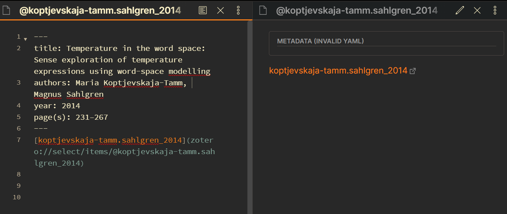
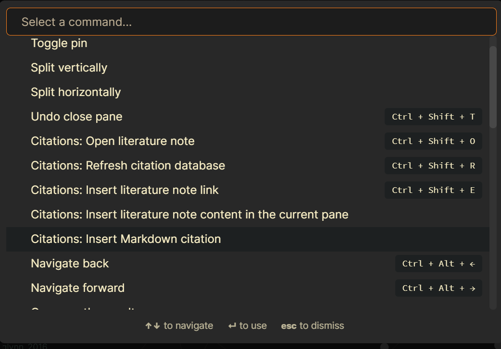

<style>
.caption {
  font-size: 0.9rem;
  font-style: italic;
}
.article-style img {
  margin-bottom:0;
}
</style>

El 12 y 19 de octubre (2021) participé de dos fantásticas sesiones organizadas por algunos colegas del Departamento de Lingüística, tituladas *I was never taught how to do this* (Nunca me enseñaron a hacer esto).

```{r, echo=FALSE}
blogdown::shortcode('tweet', '1451512845057855490')
```

Me tocó hablar de [Git y Github](../2021-04-10-learning-slopes/index.en.html), [Zotero](https://www.zotero.org/) (con Giulia Mazzola) y [Evernote](https://evernote.com/). He usado Evernote para tomar nota por 6 años y medio ya (la mayor parte de mi carrera de investigación) y Zotero por un poco más. Sin embargo, cuando estábamos preparando la presentación Katharina Meissl nos mostró [Obsidian](https://obsidian.md/) y ahora ---quiero [mudar todo a Obsidian e instalarme para siempre](https://github.com/akosbalasko/yarle).

Acá quiero hablar de cómo estoy integrando Zotero (y [Better BibTex](https://retorque.re/zotero-better-bibtex/)) con Obsidian y cómo afecta mi toma de notas y su organización. Primero voy a [presentar Better BibTex](#bb) y luego explicar [cómo lo combinamos, junto con Zotero, con Obsidian por medio de un plugin de terceros](#howto).

# Zotero y Better BibTex {#bb}

Better BibTex te ayuda a limpiar y administrat tus referencias en Zotero. Puede que tenga más funciones de las que conozco, pero la aplicación que más me interesa es la de definir una **citation key (clave de citación)**^[Todo lo relacionado con Better BibTex me aparece en inglés aunque ponga Zotero en español]. Si sólo usás Zotero en combinación con MS Word o Open Office, esto puede ser irrelevante, pero cuando trabajás con [archivos de bib(la)tex](http://www.bibtex.org/), p.ej. para $\LaTeX$ o R Markdown, es muy importante.

Una entrada de BibTex se ve así:

```{r, echo=FALSE, comment=""}
toBibtex(citation('blogdown'))
```

La palabra precedida por `@` indica el tipo de elemento (p.ej. *Manual* 'Manual', *Book* 'Libro'), y la entrada en sí consiste en pares de etiquetas con valores con distintos tipos de información bibliográfica. En este caso, la obtuve por medio de las funciones `toBibtex()` y `citation()` en R, pero también se puede encontrar este formato como opción para descargar una cita o entre las opciones de exportación de Zotero. Si tenés un archivo con entradas de BibTex, también las podés importar a Zotero (o si copias una entrada de BibTex, ¡podés importarla a Zotero desde el portapapeles!).

R Markdown y $\LaTeX$ pueden leer archivos de BibTex: les das la *citation key* y, cuando se compila el texto, tu fuente es citada a la perfección. Por ejemplo, en R Markdown podría escribir `[@montes_2021]` para citar mi tesis, y se vería `(Montes 2021)` o lo que sea que corresponda según el estilo de citación. Luego, toda la información relevante conectada a la *citation key* `montes_2021` sería recolectada para la referencia completa.

Sin embargo, las entradas de arriba no tienen *citation key*. Por defecto, tendrías que agregarlas manualmente, antes de la coma en la primera línea de cada entrada.^[En R Markdown, podés usar `knitr::write_bib()` para crear el mismo resultado pero con buenas *citation keys*.] Cuando exportás tus entradas de Zotero sin Better BibTex, por otro lado, tenés claves por defecto pero suelen ser nombres largos en camelCase, p. ej. `montesCloudspotting2021`. Better BibTex te da un patrón básico más lindo y la posibilidad de crear tus propias plantillas para *citation keys* más fáciles de recordar.

Una vez que has [instalado Better BibTex](https://retorque.re/zotero-better-bibtex/installation/), vas a encontrar una nueva sección en las Preferencias de Zotero, en la que podés definir una [plantilla](https://docs.jabref.org/setup/citationkeypatterns) para tus *citation keys*. La mía usa, en minúscula, el apellido del primer autor, separado con un punto del apellido del segudno autor o, cuando hay más de dos, *etal*. Luego agrega un guión bajo y el año.


Este es un buen patrón para mí porque se parece a cómo pienso en las referencias que cito: `montes_2021` para Montes (2021); `kiela.clark_2014` para Kiela & Clark (2014); `heylen.etal_2015` para Heylen et al. (2015). Cuando varias publicaciones terminan con la misma clave, Better BibTex agrega automáticamente *a*, *b*, *c*... a las claves correspondientes. Tenés que recordar cuál es cual, pero tampoco es tan difícil buscarlas:


En otras palabras, Better BibTex te ofrece una experiencia más amena con los archivos BibTex, por ejemplo si usás R Markdown o $\LaTeX$. Ahora bien... ¿qué hay de Obsidian?

# Citation plugin for Obsidian {#howto}

I can make Obsidian and Zotero talk to each other thanks to [a plugin](https://github.com/hans/obsidian-citation-plugin). Obsidian requires you to first enable community plugins, but then it's really easy to install it.


Once you turn off 'Safe mode', you have to 'browse community plugins', search for the citation plugin, install it *and enable it* to use it. That's it.

One of its most interesting features is the **literature note**: a note with bibliographical information extracted from your Zotero entry... well, technically, from a BibTex file exported from Zotero (or any other bibliography manager). I will address this later, but for now let's assume you have a BibTex file with all your Zotero data. With `Ctrl`+`Shift`+`E`, you get a dropdown menu in which you can search through all your entries. Once you select one, it creates a note that, by default, uses your **citation key** as the title, and adds a bunch of information to the preamble of your note. It can also add other information, such as the abstract or, more interestingly... *a link to your Zotero entry*. When you click on that link, it opens Zotero; if it is already open, it selects the reference you clicked on.

This is a lot of information, I know. That is why I will first show how I'm using this plugin now and then I will talk a bit more about how to customize the literature note and create other links to Zotero entries by hand.

## How I use it

Back when I was using Evernote, I had one notebook per source I read and its first note was a sort of bibliographical card, with basic information so I remembered what it was a long time later (it also forced me to check the outline of a paper, for example, and get more familiar with it before reading it). Sometimes, when a source A cited another source B I had already taken notes from, I would link the citation in notebook A to the bibliographical card of B.
Setting this up required me to copy the information from Zotero, and I found it sad that it wasn't really *connected* to Zotero itself.

With Obsidian, inside my research vault, I have a folder for "Reading notes", where I plan to add folders for different sources (and import them from Evernote, too). It turns out that one of the citation plugin's main features, the literature note, is precisely an *automatic version* of my beloved bibliographical card!

As an example, let's say I want to add a folder for notes on Koptjevskaja-Tamm and Sahlgren's (2014) paper. First, I press `Ctrl`+`Shift`+`E` and select the right entry.


This creates the following literature note in my "Reading notes" folder:



The main bibliographical information is in the Yaml (but need not be), and then there is a hyperlink that shows the citation key (which, preceded by a `@`, is also the name of the note) and takes you to the Zotero entry: if I click on it, it goes to Zotero and highlights that reference.

I will later add the abstract, the outline of the paper and some comments on why I'm reading it. I also manually create the "Koptjevskaja-Tamm & Sahlgren (2014)" folder to add my new literature note and, later, other notes I might want to make.

{}
Next to creating the literature note, if you are also using the "Daily notes" plugin of Obsidian, it will automatically add an internal link to your new literature note in your current Daily note! Awesome integration with your new favorite journal!
{}

Because the name of the note follows your chosen citation key pattern, you can easily use it to reference the source as well as the bibliographical data. So my current (new) practice is to add *all* references (that is, when I take notes from a source that is citing another source I might be interested in) in the format of internal notes.

For example, suppose I'm taking notes for Koptjevskaja-Tamm & Sahlgren (2014) and it references Lenci (2018). I could write it as `[[@lenci_2018]]`, i.e. an internal link to the literature note that I could create for that second source. Even if I have not created the note yet, Obsidian lets me create the link, which means that (i) whenever I create the note it will be already linked and (ii) *notes that cite the same source will be linked in the note network*. The image below shows a bit of my network of notes: there is no literature note for `@curran_2004` yet, but it is referenced in two notes and thus connects them.


The easy citation key pattern means that I can guess what the reference should look like, but if there is a chance that it actually ends in *a*, *b*, etc., I can also use the plugin's citation tool. I haven't created a hotkey for it yet, so I have to go to Obsidian's command palette and choose `Citations: Insert Markdown citation`, which takes me to a menu of all my references again.



The plugin allows you two kinds of citation ---you access the primary one by pressing `Enter` and the secondary one with `Shift`+`Enter`. By default, this will insert something like `[@lenci_2018]`, i.e. the [pandoc format](https://pandoc.org/MANUAL.html#extension-citations) used by R Markdown. But, as I will show later, you can customize it to return `[[@lenci_2018]]`, and therefore it becomes a link that you know for sure will take you to a(n eventual) literature note for that source. You can even customize it to return `[@lenci_2018](zotero://select/items/@lenci_2018)`, that is, the Zotero entry in your Desktop app!^[The pattern to create the link to the Zotero entry is `zotero://select/items/@` + the citekey (e.g. `lenci_2018`)]

As a plus, you can then copy the texts with references to your R Markdown files to create nice articles with perfect citations, just by replacing `[[` with `[` and `]]` with `]`.

## Customize the plugin

For a better, smoother, more tailored experience with the citation plugin, you can customize it in a few ways. I will show here what it looks like for me.

In the Settings of Obsidian and the section for the Citation plugin, you first have a few configuration items to take care of.


- I use BibLaTex (as opposed to JSON) format for my entries, which I described above (as BibTex).
- I have exported my full Zotero library as a `Library.bib` file, which is stored at the top level of my vault. If you make changes to your library, you have to export it again, but then Obsidian automatically refreshes.
- When I create a literature note, it's automatically saved within "Reading notes" (and then I move it to the folder of that source).

Under the basic configuration settings there are some instructions on how to deal with the following customization sections. You will write templates with variables between double curly braces, which means that they will be replaced with the matching information for the reference you cite. In other words, once you select the reference with citation key `montes_2021`, all the variables here that say `{{citekey}}` will be replaced by `montes_2021`.


Given those instructions, the title of my literature notes starts with a `@` followed by the citation key (variable: `{{citekey}}`, example value: `montes_2021`). The initial information will be determined by the values in that template: a yaml will be created adding the values of `{{title}}` (the title of the referenced work), `{{authorString}}` (the names of the authors), `{{year}}` (the publication date) and `{{page}}` (the number of pages or the pages range), and then the body will include the hyperlink to the Zotero entry and, if available, the abstract.


```md
---
title: {{title}}
authors: {{authorString}}
year: {{year}}
page(s): {{page}}
---
[{{citekey}}]({{zoteroSelectURI}})

{{abstract}}
```


{}
In case you are not aware, you can create hyperlinks in markdown with square brackets followed by round brackets. For example, `[my thesis]` `(https://cloudspotting.marianamontes.me)` will show the text in brackets and take you to the text in parenthesis: [my thesis](https://cloudspotting.marianamontes.me). Obsidian's `[[text]]` is a shortcut for `[text]` `(text)`. Therefore, if I take a citation key `{{citekey}}` and place it between the square brackets, and then the `{{zoteroSelectURI}}` variable between the round brackets, I will get a hyperlink that looks like the citation key but takes me to the Zotero entry, as I showed in the example of my literature note above. 
{}

The same knowledge can be used with the last section of the customization, which relates to the citation templates.


As I mentioned before, you can have a primary and a secondary citation: when you ask for the citation in the command palette and it shows you the possible entries, `Enter` prints the primary citation and `Shift`+`Enter` prints the secondary one. In the images above, I designed the primary citation to print the hyperlink to the Zotero entry, and the secondary one to print the reference to the literature note `[[@{{citekey}}]]`, e.g. `[[@montes_2021]]`.

Finally, I would like to point out that I've been working with both Markdown and Better BibTex for a while, so if you haven't, this can look like a lot to take. I hope you can find the time to experiment with this (or at least copy what I did, it might work for you!) and it helps your note taking, bibliography management and general levels of fun and stress!